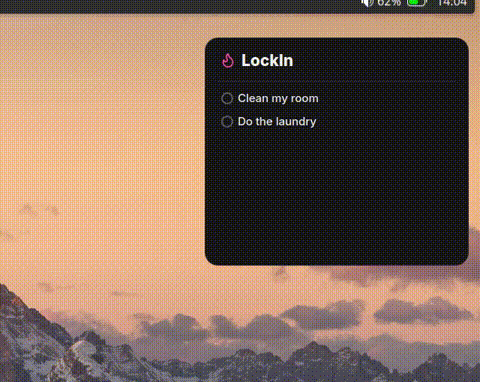

# 🔥 KDE ToDo

A minimalist to-do list widget for the KDE Plasma 6 desktop.

<p align="center">
  
</p>

## How it works

- Hover over the widget and click **+** to add a task. Press Enter to save.
- Click the circle to complete a task.
- Completed tasks are deleted. There is no history.

## Customization

Right-click the widget → **Configure...**:

- **Title**: shown at the top.
- **Accent color**: orange, blue, green, purple, pink or red.
- **Theme**: dark or light.

## Installation

Requires KDE Plasma 6.

```sh
git clone https://github.com/JvCasc/KDE-ToDo.git
cd KDE-ToDo
kpackagetool6 -t Plasma/Applet -i package
```

Then right-click the desktop → **Add Widgets...** → search for **KDE ToDo List**.

### Update

```sh
git pull
kpackagetool6 -t Plasma/Applet -u package
```

If the change doesn't show up, restart Plasma:

```sh
systemctl --user restart plasma-plasmashell
```

### Uninstall

```sh
kpackagetool6 -t Plasma/Applet -r com.jvcasc.kdetodo
```

## Credits

- [Inter](https://rsms.me/inter/) font, SIL OFL 1.1
- [Lucide](https://lucide.dev/) icons, ISC License

## License

GPL-2.0-or-later
